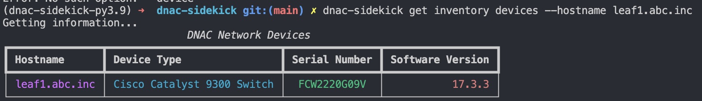
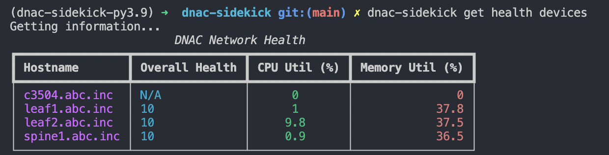

[](https://github.com/psf/black)
[](https://codecov.io/gh/dannywade/dnac-sidekick)
[](https://developer.cisco.com/codeexchange/github/repo/dannywade/dnac-sidekick)

# dnac-sidekick
DNAC Sidekick is a CLI app used to interact with Cisco DNA Center (DNAC). It's built using the [Click](https://github.com/pallets/click) and [Rich](https://github.com/Textualize/rich) libraries. The Rich library is what helps make the output look cleaner to the end-user. 

The goal of the tool is to provide a clean and user-friendly CLI interface to quickly pull information from DNA Center. All interactions with DNAC uses DNA Center's REST API, so please make sure that the REST API is enabled and the user account(s) used with this tool have proper API permissions.

## Installation
Install using `pip` or any other PyPi package manager:
```
pip install dnac-sidekick
```

## Getting Started

### Authenticating to DNAC
DNAC-Sidekick pulls all user-specific information from environmnet variables. Ideally, this would be a more automated process with less manual work for the user, but for now, the following environment variables must be set manually before using the tool:
```
export DNAC_URL=<https://dnac_url>
export DNAC_USER=<username>
export DNAC_PASS=<password>
```

Once set, we will need to generate a bearer token, which is used to authenticate to the DNAC REST API. You can manually generate this token using curl or Postman, but there's also a built-in command that will generate one for you. This will only work if the URL, username, and password environment variables are set.

```
dnac-sidekick login 

Token generated successfully!
Copy token below and set as environment variable for future requests:
eyJhbGciOiJS.....
```

*IMPORTANT:* Please make sure to generate the bearer token using the `dnac-sidekick login` command *AFTER* setting the necessary environment variables. Once the token is generated, don't forget to set it as an environment variable as well.

```
export DNAC_TOKEN=<token>
```

## Usage
To see what commands are available, use the `--help` option. Here's a brief look at the current root commands available:
```
Options:
  --help  Show this message and exit.

Commands:
  command-runner  Run 'show' commands on network devices in DNAC.
  get             Action for read-only tasks and gathering information.
  login           Use username and password to authenticate to DNAC.
```

## Feature Highlights
The goal is to provide features that help extract the most useful information from DNAC for the user. The tool is not built to have a command for every available DNAC API call - it's simply meant to be an engineer's *sidekick* :grin: when interacting with Cisco DNA Center. This feature list will grow, but here are the current tasks that can be performed using DNAC Sidekick:

**Inventory**
- Device information (all devices or a specific device via hostname)
  - Hostname
  - Device type
  - Serial number
  - Software version
- Device license information
  - Network license level
  - DNA license level
  - License validity (valid or expired)
  - Virtual account
  - Device UDI

**Assurance**
- Device health
- Client health
  - All
  - Wired
  - Wireless

**Command Runner**
- Run *valid* `show` commands on any device in DNAC inventory
  - Valid `show` commands are dictated by DNAC

## Examples:
**Inventory** 
```
# All devices
dnac-sidekick get inventory devices

# Specific device
dnac-sidekick get inventory devices --hostname leaf1.abc.inc

# License info
dnac-sidekick get licenses
```

**Assurance** 
```
# Device health
dnac-sidekick get health devices

# Client health
dnac-sidekick get health clients
```

**Command Runner** 
```
dnac-sidekick command-runner --device leaf1.abc.inc --command "show run"
```

<details>
<summary>Sample Outputs</summary>

***All sample outputs use the Cisco DevNet Always-on DNAC sandbox.***

### Network Inventory


### Network Inventory - Specific Device


### Device Licensing


### Device Health


### Client Health


</details>
<br>

## Compatibility
Tested with:
- DNA Center 2.2.3.4
- DNA Center 2.2.3.6
- DNA Center 2.3.4.0

*If you are able to test with other versions, please open a PR and add it to the list!*

## Credits
This section is dedicated to those that have helped test and make this tool better!
- [raoulmorik](https://github.com/raoulmorik)